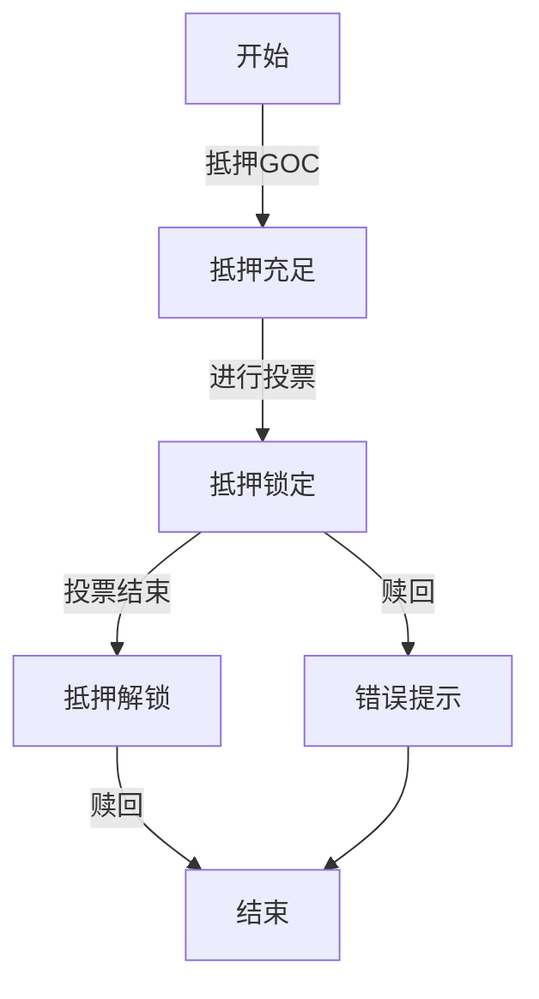
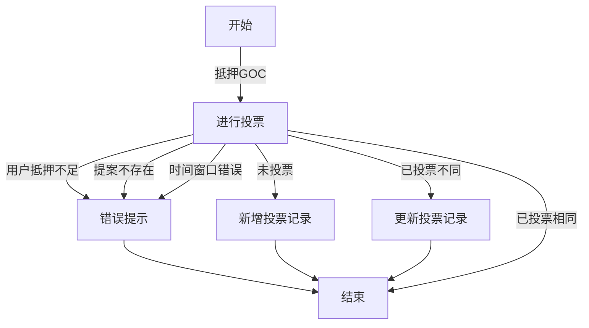
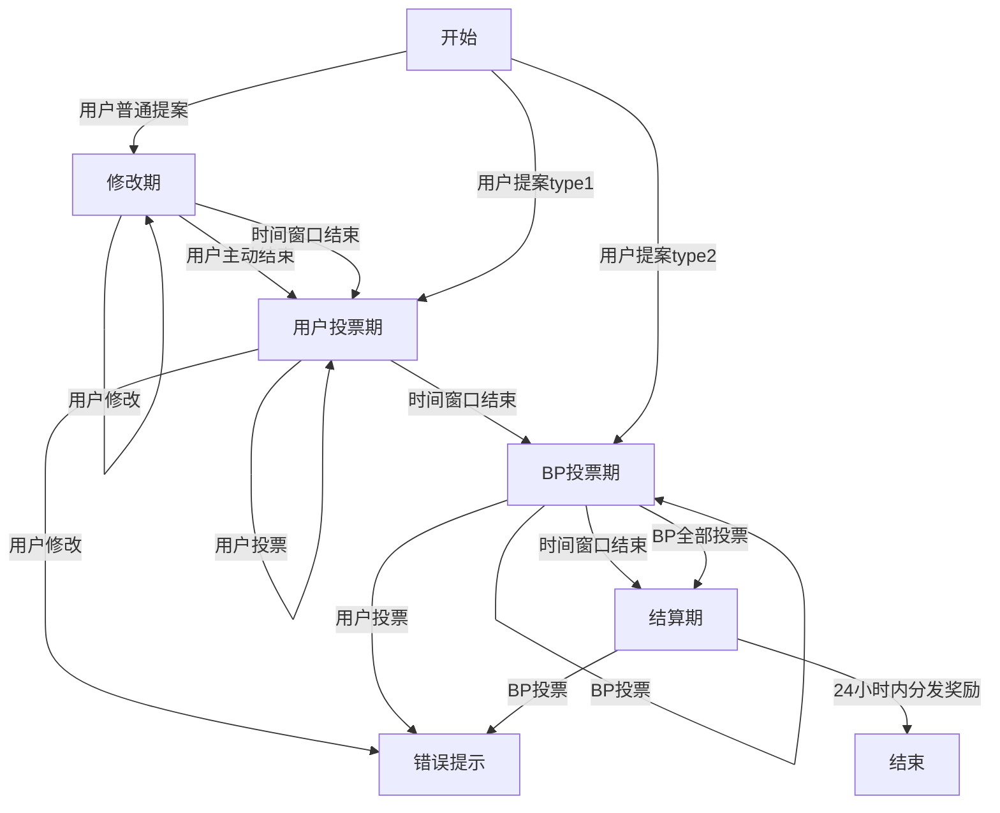

# GOC命令行操作说明

## 用户抵押和赎回GOC

### 抵押

```bash
Stake for Governance
Usage: cleos system gocstake [OPTIONS] payer

Positionals:
  payer TEXT                  The account staking for Governance (required)

Options:
  -h,--help                   Print this help message and exit
  -x,--expiration             set the time in seconds before a transaction expires, defaults to 30s
  -f,--force-unique           force the transaction to be unique. this will consume extra bandwidth and remove any protections against accidently issuing the same transaction multiple times
  -s,--skip-sign              Specify if unlocked wallet keys should be used to sign transaction
  -j,--json                   print result as json
  -d,--dont-broadcast         don't broadcast transaction to the network (just print to stdout)
  --return-packed             used in conjunction with --dont-broadcast to get the packed transaction
  -r,--ref-block TEXT         set the reference block num or block id used for TAPOS (Transaction as Proof-of-Stake)
  -p,--permission TEXT ...    An account and permission level to authorize, as in 'account@permission'
  --max-cpu-usage-ms UINT     set an upper limit on the milliseconds of cpu usage budget, for the execution of the transaction (defaults to 0 which means no limit)
  --max-net-usage UINT        set an upper limit on the net usage budget, in bytes, for the transaction (defaults to 0 which means no limit)
```

```bash
cleos system gocstake useraaaaaaaa
```

### 赎回

```bash
Unstake for Governance
Usage: cleos system gocunstake [OPTIONS] receiver 

Positionals:
  receiver TEXT               The account to receive GOC for unstake governance (required)

Options:
  -h,--help                   Print this help message and exit
  -x,--expiration             set the time in seconds before a transaction expires, defaults to 30s
  -f,--force-unique           force the transaction to be unique. this will consume extra bandwidth and remove any protections against accidently issuing the same transaction multiple times
  -s,--skip-sign              Specify if unlocked wallet keys should be used to sign transaction
  -j,--json                   print result as json
  -d,--dont-broadcast         don't broadcast transaction to the network (just print to stdout)
  --return-packed             used in conjunction with --dont-broadcast to get the packed transaction
  -r,--ref-block TEXT         set the reference block num or block id used for TAPOS (Transaction as Proof-of-Stake)
  -p,--permission TEXT ...    An account and permission level to authorize, as in 'account@permission'
  --max-cpu-usage-ms UINT     set an upper limit on the milliseconds of cpu usage budget, for the execution of the transaction (defaults to 0 which means no limit)
  --max-net-usage UINT        set an upper limit on the net usage budget, in bytes, for the transaction (defaults to 0 which means no limit)

```

```bash
cleos system gocunstake useraaaaaaaa
```

### 查看抵押

```bash
Display governance stake
Usage: cleos system listgocstake [OPTIONS] account

Positionals:
  account TEXT                The account governance stake (required)

Options:
  -h,--help                   Print this help message and exit
  -j,--json                   Output in JSON format
```

```bash
cleos system listgocstake useraaaaaaaa
```

## 用户创建、更新提案

### 创建提案

```bash
Create governance proposal
Usage: cleos system createproposal [OPTIONS] owner fee name content url

Positionals:
  owner TEXT                  The owner of created proposal (required)
  fee TEXT                    The amount of GOC for create proposal (required)
  name TEXT                   The name of created proposal (required)
  content TEXT                The content of created proposal (required)
  url TEXT                    The url of created proposal (required)

Options:
  -h,--help                   Print this help message and exit
  --start-type UINT           Set start type, 1 for start vote, 2 for start bp vote(DEBUG)
  -x,--expiration             set the time in seconds before a transaction expires, defaults to 30s
  -f,--force-unique           force the transaction to be unique. this will consume extra bandwidth and remove any protections against accidently issuing the same transaction multiple times
  -s,--skip-sign              Specify if unlocked wallet keys should be used to sign transaction
  -j,--json                   print result as json
  -d,--dont-broadcast         don't broadcast transaction to the network (just print to stdout)
  --return-packed             used in conjunction with --dont-broadcast to get the packed transaction
  -r,--ref-block TEXT         set the reference block num or block id used for TAPOS (Transaction as Proof-of-Stake)
  -p,--permission TEXT ...    An account and permission level to authorize, as in 'account@permission'
  --max-cpu-usage-ms UINT     set an upper limit on the milliseconds of cpu usage budget, for the execution of the transaction (defaults to 0 which means no limit)
  --max-net-usage UINT        set an upper limit on the net usage budget, in bytes, for the transaction (defaults to 0 which means no limit)
```

```bash
cleos system createproposal useraaaaaaab "1000.000 SYS" "Name" "Content" "URL"
cleos system createproposal useraaaaaaab "1000.000 SYS" "Name" "Content" "URL" --start-type 1
```
其中start_type选项如下:  
0: 正常，和不输入相同  
1: 跳过等待时间，直接启动用户投票  
2: 跳过用户投票阶段，直接启动BP投票 ，测试目的  


### 更新提案

```bash
Update governance proposal
Usage: cleos system updateproposal [OPTIONS] owner id name content url

Positionals:
  owner TEXT                  The owner of updating proposal (required)
  id TEXT                     The id of updating proposal (required)
  name TEXT                   The name of updating proposal (required)
  content TEXT                The content of updating proposal (required)
  url TEXT                    The url of updating proposal (required)

Options:
  -h,--help                   Print this help message and exit
  -x,--expiration             set the time in seconds before a transaction expires, defaults to 30s
  -f,--force-unique           force the transaction to be unique. this will consume extra bandwidth and remove any protections against accidently issuing the same transaction multiple times
  -s,--skip-sign              Specify if unlocked wallet keys should be used to sign transaction
  -j,--json                   print result as json
  -d,--dont-broadcast         don't broadcast transaction to the network (just print to stdout)
  --return-packed             used in conjunction with --dont-broadcast to get the packed transaction
  -r,--ref-block TEXT         set the reference block num or block id used for TAPOS (Transaction as Proof-of-Stake)
  -p,--permission TEXT ...    An account and permission level to authorize, as in 'account@permission'
  --max-cpu-usage-ms UINT     set an upper limit on the milliseconds of cpu usage budget, for the execution of the transaction (defaults to 0 which means no limit)
  --max-net-usage UINT        set an upper limit on the net usage budget, in bytes, for the transaction (defaults to 0 which means no limit)
```

```bash
cleos system updateproposal useraaaaaaab [pid] "New_name" "New_content" "New_URL"
```

## 用户投票

### 投票

```bash
Vote governance proposal
Usage: cleos system voteproposal [OPTIONS] owner id vote

Positionals:
  owner TEXT                  The voting user (required)
  id TEXT                     The id of voting proposal (required)
  vote TEXT                   Vote of voting proposal (required)

Options:
  -h,--help                   Print this help message and exit
  --bpvote                    vote as bp
  -x,--expiration             set the time in seconds before a transaction expires, defaults to 30s
  -f,--force-unique           force the transaction to be unique. this will consume extra bandwidth and remove any protections against accidently issuing the same transaction multiple times
  -s,--skip-sign              Specify if unlocked wallet keys should be used to sign transaction
  -j,--json                   print result as json
  -d,--dont-broadcast         don't broadcast transaction to the network (just print to stdout)
  --return-packed             used in conjunction with --dont-broadcast to get the packed transaction
  -r,--ref-block TEXT         set the reference block num or block id used for TAPOS (Transaction as Proof-of-Stake)
  -p,--permission TEXT ...    An account and permission level to authorize, as in 'account@permission'
  --max-cpu-usage-ms UINT     set an upper limit on the milliseconds of cpu usage budget, for the execution of the transaction (defaults to 0 which means no limit)
  --max-net-usage UINT        set an upper limit on the net usage budget, in bytes, for the transaction (defaults to 0 which means no limit)
```

```bash
cleos system voteproposal useraaaaaaab [pid] 0
cleos system voteproposal useraaaaaaab [pid] 1

```
其中需指定proposal的唯一id，投票内容0为否定，1为肯定

### 用户更新投票

指令与投票一致，系统会自动判断调整票数

### BP投票

### BP更新投票

## 奖励结算

提案完成后24小时，将提案奖励发放至用户的待领取奖励，用户使用EOS原有的refund即可获取奖励

## GOC 系统数据查询

### proposal table

```bash
cleos get table eosio eosio proposals
```

### vote table

```bash
cleos get table eosio [pid] votes
```
其中pid即为提交后系统返回的提案id

### reward table

```bash
cleos get table eosio useraaaaaaab rewards
```

## 系统业务逻辑流程

### GOC抵押赎回



### 用户投票



### 投票生命周期


